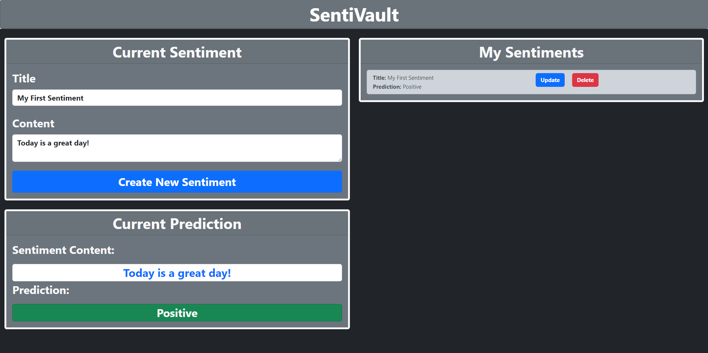

# 🤖SentiVault🔒

A web application where users can input and store their sentiments. An AI model then analyzes these sentiments and predicts whether they are "Positive" or "Negative".

Technology Stack:
- Back-end: Django & Django REST Framework
- Front-end: React
- Other Tools: TensorFlow, Bootstrap, GitHub Actions, SQLite

## Installation Steps

1. Ensure you have an IDE with Python installed.
2. [Clone](https://docs.github.com/en/repositories/creating-and-managing-repositories/cloning-a-repository) this repository into the IDE (preferably Visual Studio Code) on your local machine.
3. Open a new command prompt or terminal and make sure your directory looks like this: `...\SentiVault`.
4. Create a virtual environment and ensure you're using the Python interpreter inside the virtual environment.
5. Run `.venv/Scripts/activate`.
6. Run `pip install -r requirements.txt`.
7. Run `cd django_backend`.
8. Open a new terminal (while keeping the previous one) and perform Step 6.
9. In this terminal run `cd react_frontend`. You should now have two terminals open, with the first one looking like `(.venv) ... \django_backend` and the second one `(.venv) ... \react_frontend`. We will call the first and second terminal back-end terminal and front-end terminal respectively.
10. In the front-end terminal, run [these commands](https://nodejs.org/en/download/package-manager) to install Node.js.
11. In the back-end terminal, run `python manage.py runserver`. This will start up the back-end Django server.
12. In the front-end terminal, run `npm start`. This will start up your front-end.
13. If a browser window doesn't automatically show up, open up a browser and enter `http://localhost:3000/`.

## How to Use

### Creating a Sentiment

To create a sentiment, simply enter a Title and Content on the upper-left box and click the `Create New Sentiment` button.

### View and Update a Sentiment

The created sentiments will all be listed under the `My Sentiments` section on the upper-right box. To view a particular sentiment, hit the `Update` button and a pop-up will be displayed. To update, enter your new desired information for the sentiment and hit `Update` in the pop-up.

### Sentiment Prediction

After each creation or update of a sentiment, the `Current Predictions` box will be updated accordingly to display the content of the current sentiment. A Tensorflow Neural Network model from the back-end will predict on whether this sentiment is "Positive" or "Negative".

### Deleting a Sentiment

To delete a sentiment, simply hit the `Delete` button for the selected sentiment you would like to remove.

## Acknowledgements

The sentiment analysis model was made by following this [Tensorflow Tutorial](https://www.tensorflow.org/tutorials/keras/text_classification).